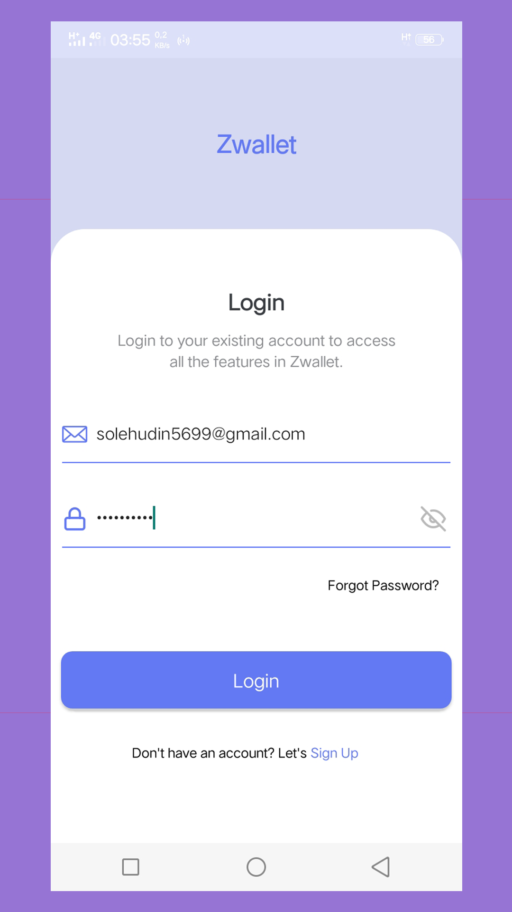
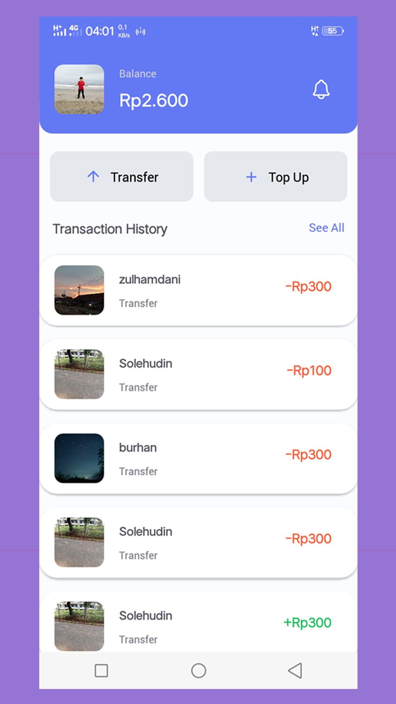
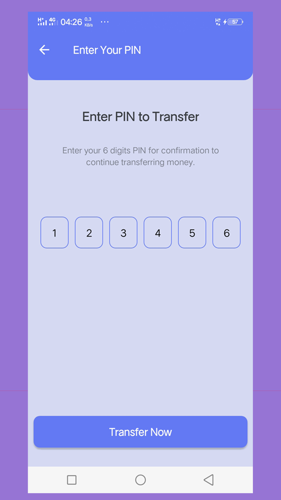

# Zwallet App 

<div align="center">
    
</div>

## Contents

- [Description](#description)
- [Features](#features)
- [Usage](#usage-application)
- [Requirements](#requirements-for-development)
- [Installation](#installation-for-development)
- [Screenshoots](#screenshoots)
- [Release APK](#release-apk)
- [Related Project](#related-project)

## Description

**Zwallet App** is a digital wallet application where users can transfer between each other
users via available contacts. For security, each user
required to have a PIN. Other features include resetting passwords, editing profiles, and more.

## Features

- Transfer Money
- Notification
- Edit Profile
- Reset Password
- Change Password & PIN

## Usage Application

- [`Download`](#release-apk) and install the app in your android device
- Register new account, then login with your new account
- If you can log in, you can use the feature

## Requirements for Development

- [`Node Js`](https://nodejs.org/en/)
- [`npm`](https://www.npmjs.com/get-npm)
- [`react-native`](https://facebook.github.io/react-native/docs/getting-started)
- [`react-native-cli`](https://facebook.github.io/react-native/docs/getting-started)
- [`Zwallet Backend`](https://github.com/solehudin5699/ZWALLET-backend.git)

## Installation for Development

1. Open your terminal or command prompt
2. Type `git clone https://github.com/solehudin5699/ZWALLET-frontend.git`
3. Open the folder and type `npm install` for install dependencies
4. Create file titled **_sharedVariable.js_** in root folder with the following contents :

```javascript
export const serverAddress = 'server_address_for_backend';
export const socketServerAddress = 'server_address_for_socket';
```

Example :

```javascript
export const serverAddress = 'http://localhost:8000';
export const socketServerAddress = 'http://localhost:8001';
```

5. Before run this, you must installation backend and then run backend
6. Type `react-native run-android` in terminal for run this app. **_Make sure your device is connected with debugging mode_**.

## Screenshoots

<div align="center">
       
    
    
</div>

## Release APK

Download this apk release for getting experience with this app.

<a href="http://bit.ly/zwallet_app">
  
</a>

## Related Project

RESTful API for this application, clone this for development Zwallet App.

<a href="https://github.com/solehudin5699/ZWALLET-backend.git">

</a>
