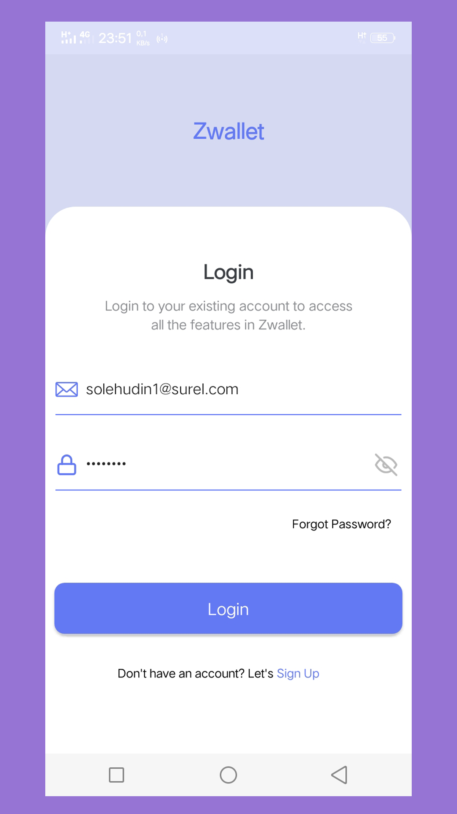

# Zwallet App

    

## Contents

- [Description](#description)
- [Features](#features)
- [Usage](#usage-application)
- [Requirements](#requirements)
- [Installation](#installation)
- [Screenshoots](#screenshoots)
- [Release APK](#release-apk)
- [Related Project](#related-project)

## Description

**Zwallet App** is a digital wallet application where users can transfer between each other
users via available contacts. For security, each user
required to have a PIN. Other features include resetting passwords, editing profiles, and more.

## Features

- Transfer Money
- Notification
- Edit Profile
- Reset Password
- Change Password & PIN

## Usage Application

- [`Download`](#release-apk) and install the app in your device
- Register new account, then login with your new account
- If you can log in, you can use the feature

## Requirements

- [`npm`](https://www.npmjs.com/get-npm)
- [`react-native`](https://facebook.github.io/react-native/docs/getting-started)
- [`react-native-cli`](https://facebook.github.io/react-native/docs/getting-started)
- [`Zwallet Backend`](https://github.com/solehudin5699/ZWALLET-backend.git)

## Installation

1. Open your terminal or command prompt
2. Type `git clone https://github.com/solehudin5699/ZWALLET-frontend.git`
3. Open the folder and type `npm install` for install dependencies`
4. Before run this, you must installation backend and then run backend
5. Type `react-native run-android` for run this app. **_Make sure your device is connected with debugging mode_**.

## Screenshoots

       
    
    

## Release APK

## Related Project

- [Zwallet Backend](https://github.com/solehudin5699/ZWALLET-backend.git)
